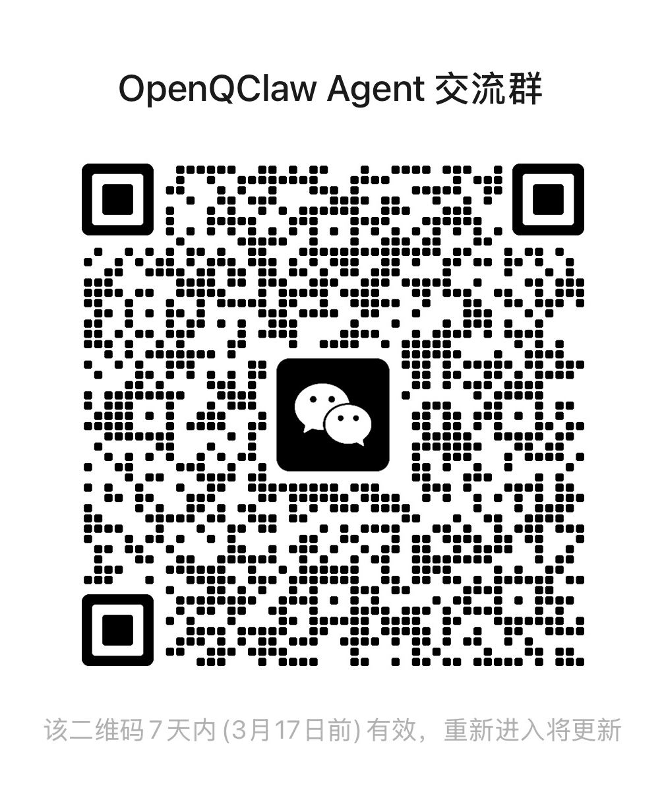

# FAQ — 常见问题

## Q1：之前安装过 QClaw，无法正常使用 OpenQClaw，提示"连接失败，请先验证邀请码"

**原因：** QClaw 原版会在本地写入配置文件和缓存，其中包含邀请码校验状态。这些残留数据会导致校验逻辑异常触发。

**解决方法：** 清除 QClaw 残留的配置文件和缓存后重新启动 OpenQClaw。

我们提供了一键清理脚本，执行前会列出所有待删除路径及其文件大小，经您确认后才会执行删除：

```bash
curl -fsSL https://raw.githubusercontent.com/haroldneo/OpenQClaw/main/scripts/clean-qclaw.sh | bash
```


---

## Q2：之前安装过 OpenQClaw，点击弹窗中的"立即更新"后无法正常使用了

**原因：** 点击"立即更新"会将 QClaw 官方原版 0.1.2 直接覆盖之前的 OpenQClaw 0.1.1 应用，覆盖后应用恢复为原版逻辑，因此会重新校验邀请码。

**解决方法：**

1. 从 GitHub [Releases](https://github.com/haroldneo/OpenQClaw/releases) 重新下载安装 OpenQClaw 0.1.2 版本
2. 运行清理脚本清除 QClaw 残留的配置文件和缓存（见 [Q1](#q1之前安装过-qclaw无法正常使用-openqclaw提示连接失败请先验证邀请码)）

> **💡 提示：** OpenQClaw 0.1.2 已修复此问题 — 即使检测到新版本弹窗，也可以正常关闭继续使用，不会被强制更新。

---

## Q3：报错提示"403 This API key has not been activated. Please enter an invitation code to activate."

**原因：** 目前 QClaw 临时阻断了当前版本直接调用无限量默认模型的 API。

**解决方法：** 经尝试，可通过**自定义模型**继续使用 OpenQClaw。测试确认可使用 **GLM-5、MiniMax M2.5、Qwen3.5** 等模型。

在 OpenQClaw 的**自定义模型**设置中添加模型信息即可继续使用。

---

## Q4：目前可以使用微信远程控制功能吗？

暂不支持。经测试确认，微信远程控制功能的服务端已增加校验逻辑，OpenQClaw 目前无法绕过该限制，仅可使用电脑端功能。

---

## 补充说明

> QClaw 原版应用仍处于快速迭代阶段，目前功能尚不完善，存在较多已知问题。我们会持续跟进其更新，维护无需内测邀请码即可使用的 OpenQClaw，直到官方正式开放公测。
>
> 如果想要体验小龙虾，也可以选择其他更成熟的 Claw 类产品，建议配合支持**流式输出**和**在线文档**等特性的消息渠道使用 — 毕竟"小而美"甚至不支持流式回复和在线文档等基础能力。
>
> 使用过程中遇到任何问题，欢迎扫码加入微信交流群，一起交流讨论 👇

<p align="center">
  
</p>
